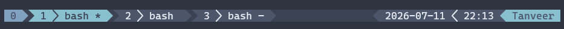

# Tmux Nord Moduler

A modular and customizable tmux status bar with multiple themes and optional terminal color theme overrides.

Modules are independent components that collect and format information such as Git status, CPU usage, RAM usage, battery level, date, and time. You can easily choose which modules appear and in what order.

## 📸 Screenshots



*Full terminal preview.*


*Status bar modules in action.*

---

## ✨ Features

* **Modular design** — Add, remove, or reorder modules through your `.tmux.conf`.
* **Git integration** — Displays the current branch with staged (`+`) and dirty (`*`) indicators.
* **System information** — CPU, RAM, battery, hostname, and user modules.
* **Context-aware modules** — Modules such as Git automatically hide themselves when there is nothing relevant to display.
* **Multiple themes** — Includes Nord, Dune, and Canopy.
* **Terminal theme override** — Optionally applies a theme's foreground, background, cursor, and full 16-color ANSI palette to the outer terminal.
* **Extensible architecture** — Modules, data collection scripts, tmux theme styling, and terminal theme application are kept separate.

---

## 📦 Installation

### Option 1: Tmux Plugin Manager

Add the plugin to your `~/.tmux.conf`:

```tmux
set -g @plugin 'tnvr000/tmux-nord-moduler'
```

Press `prefix` + `I` to install it.

### Option 2: Manual Installation

Clone the repository:

```bash
git clone https://github.com/tnvr000/tmux-nord-moduler.git ~/.tmux/plugins/tmux-nord-moduler
```

Add the following near the bottom of your `~/.tmux.conf`:

```tmux
run-shell ~/.tmux/plugins/tmux-nord-moduler/nord-moduler.tmux
```

Reload tmux:

```bash
tmux source ~/.tmux.conf
```

---

# ⚙️ Configuration

## Choosing Modules

The right side of the status bar is controlled with `@nord_mod_right`.

Modules are specified as a space-separated list.

```tmux
set -g @nord_mod_right "git directory cpu ram battery date time"
```

The order in the configuration is the order in which modules appear in the status bar.

For example:

```tmux
set -g @nord_mod_right "user hostname git directory"
```

Modules that return no output are automatically skipped without leaving unnecessary separators.

---

## Available Modules

| Module      | Description                                                                  |
| ----------- | ---------------------------------------------------------------------------- |
| `git`       | Current Git branch with staged (`+`) and dirty (`*`) indicators.             |
| `directory` | Current working directory of the active pane.                                |
| `cpu`       | Current CPU usage percentage.                                                |
| `ram`       | Current RAM usage percentage.                                                |
| `battery`   | Battery percentage and charging status. Hidden when no battery is available. |
| `date`      | Current date.                                                                |
| `time`      | Current time.                                                                |
| `hostname`  | Hostname of the current machine.                                             |
| `user`      | Current username.                                                            |

The default configuration is:

```tmux
set -g @nord_mod_right "git directory cpu ram battery date time"
```

---

# 🎨 Themes

The plugin currently includes three themes:

* `nord`
* `dune`
* `canopy`

Select a theme using `@nord_mod_theme`:

```tmux
set -g @nord_mod_theme "canopy"
```

If no theme is configured, the plugin uses `nord`.

```tmux
set -g @nord_mod_theme "nord"
```

If an invalid theme name is provided, the plugin falls back to Nord.

## Terminal Theme Override

By default, themes only control tmux itself. The optional terminal theme override can also apply the selected theme's terminal palette to the outer terminal emulator.

Enable it with:

```tmux
set -g @nord_mod_terminal_theme_override "on"
```

Disable it with:

```tmux
set -g @nord_mod_terminal_theme_override "off"
```

It is **off by default** because this changes the terminal's colors outside of tmux's own status bar and pane styling.

When enabled, the selected theme applies:

* Default foreground color.
* Default background color.
* Cursor color.
* ANSI color palette entries `0` through `15`.

The terminal palette is applied using standard OSC terminal color sequences. This is designed to work across terminal emulators that support these sequences; terminal-specific profile settings such as custom bold or selection colors are intentionally not controlled.

---

# 🛠️ Creating Custom Modules

Each module consists of two layers:

```text
scripts/<name>.sh
        ↓
modules/<name>.tmux
        ↓
dispatcher.sh
        ↓
status bar
```

The script is responsible for collecting data.

The module is responsible for deciding how that data should be displayed.

For example:

```text
scripts/weather.sh
modules/weather.tmux
```

Then add the module to your configuration:

```tmux
set -g @nord_mod_right "git weather cpu time"
```

## Script Contract

`scripts/<name>.sh`

Scripts should:

* Collect data only.
* Return plain text.
* Avoid icons and colors.
* Avoid tmux formatting.
* Return empty output when there is nothing to display.

Example:

```bash
#!/usr/bin/env bash

echo "24°C"
```

## Module Contract

`modules/<name>.tmux`

A module should:

* Define a function named `module_<name>`.
* Call the corresponding script when necessary.
* Decide whether the module should be displayed.
* Add icons and presentation formatting.
* Avoid directly collecting system information.

Example:

```bash
#!/usr/bin/env bash

module_weather() {
  local weather

  weather="$($SCRIPTS_DIR/weather.sh)"

  [[ -z "$weather" ]] && return

  echo "󰖨  $weather"
}
```

The module name and function name must match:

```text
modules/weather.tmux
module_weather()
```

---

# 🎨 Theme Contract

Every theme defines the colors used by the tmux status bar and, when terminal theme override is enabled, the outer terminal palette.

## tmux Theme Colors

At minimum, a theme should define:

```bash
THEME_NAME

THEME_BASE_BG
THEME_BASE_FG

THEME_ACCENT_BG
THEME_ACCENT_FG

THEME_STATUS_BG
THEME_STATUS_FG

THEME_SESSION_BG
THEME_SESSION_FG

THEME_WINDOW_BG
THEME_WINDOW_FG

THEME_WINDOW_CURRENT_BG
THEME_WINDOW_CURRENT_FG

THEME_PANE_BORDER
THEME_PANE_ACTIVE_BORDER

THEME_MODULE_BG
THEME_MODULE_FG

THEME_MODE_FG
THEME_MODE_NORMAL_BG
THEME_MODE_COMMAND_BG
THEME_MODE_COPY_BG
THEME_MODE_OTHER_BG
```

## Terminal Theme Colors

Themes that support terminal theme override define:

```bash
THEME_FG
THEME_BG
THEME_CURSOR

THEME_COLOR_0
THEME_COLOR_1
THEME_COLOR_2
THEME_COLOR_3
THEME_COLOR_4
THEME_COLOR_5
THEME_COLOR_6
THEME_COLOR_7
THEME_COLOR_8
THEME_COLOR_9
THEME_COLOR_10
THEME_COLOR_11
THEME_COLOR_12
THEME_COLOR_13
THEME_COLOR_14
THEME_COLOR_15
```

`THEME_COLOR_0` through `THEME_COLOR_15` correspond to the standard 16-color ANSI palette.

Theme files are stored in:

```text
themes/
```

For example:

```text
themes/nord.tmux
themes/dune.tmux
themes/canopy.tmux
```

---

# 🏗️ Architecture

The project separates theme data, tmux presentation, terminal presentation, and module logic:

```text
themes/*.tmux
      │
      ├── tmux theme colors
      └── terminal color palette

lib/theme_apply.tmux
      │
      └── applies tmux status bar and pane colors

lib/terminal_theme_apply.tmux
      │
      └── applies terminal foreground/background,
          cursor, and ANSI palette colors

scripts/*.sh
      │
      └── collect data

modules/*.tmux
      │
      └── format module output
```

The terminal theme application writes standard terminal OSC color sequences to the attached client's TTY. Initial clients are handled during plugin startup, while newly attached clients are handled through a tmux `client-attached` hook.

---

# 📝 Requirements

* tmux 2.9 or later.
* A patched [Nerd Font](https://www.nerdfonts.com/) for icons to render correctly.
* A terminal emulator that supports the standard OSC color sequences if terminal theme override is enabled.
